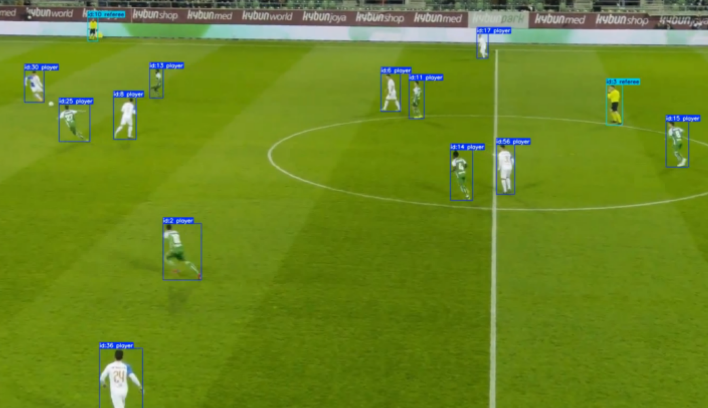

# YOLO-Soccer-Track

[](https://opensource.org/licenses/MIT)
[](https://www.python.org/downloads/)
[](https://pytorch.org/)
[](https://github.com/ultralytics/ultralytics)
[](https://nic.xjtu.edu.cn/info/1016/8675.htm)

> **注意：本仓库已不再维护。** 此项目为IKCEST挑战赛的足球比赛目标跟踪解决方案，仅供参考。


 

## 🏆 竞赛成果

本项目在**2024 IKCEST第六届"一带一路"国际大数据竞赛暨第十届百度&西安交大大数据竞赛**中获得**初赛检测算法榜TOP2**的成绩。

### 竞赛链接
- [比赛官网](https://aistudio.baidu.com/competition/detail/1196/0/leaderboard) - 百度AI Studio

### 评分详情 (2024-09-04)

| 团队 | 总分 | IDF1 | HOTA | MOTA |
| ---- | ---- | ---- | ---- | ---- |
| Tang的团队 | 2.33606 | 0.76845 | 0.69111 | 0.87649 |

## 📝 说明

本项目同时也是我的毕业设计作品，完整实现了足球比赛目标检测与跟踪的全流程解决方案。

基于YOLOv12的足球比赛实时目标检测与跟踪系统实现，可用于分析足球比赛视频中的球员、裁判和足球等目标。

## 🔧 技术栈

- **深度学习框架**：PyTorch 2.x
- **目标检测**：YOLOv12/YOLOv8/RT-DETR
- **视觉处理**：OpenCV 4.x
- **用户界面**：Gradio
- **数据处理**：Pandas, NumPy
- **并行处理**：Python ThreadPoolExecutor

## 📋 项目概述

本项目实现了一个完整的足球比赛视频目标检测与跟踪系统，可以实时识别并追踪视频中的球员、裁判和足球等目标。系统基于最新的YOLOv12模型构建，并针对足球比赛场景进行了优化，提供了从数据处理、模型训练到推理部署的全流程解决方案。

### 核心特性

- **多模型支持**：集成YOLOv8/v10/v11/v12和RT-DETR等多种先进目标检测模型
- **高性能实时跟踪**：对足球场景的目标进行准确的检测与ID跟踪
- **友好的用户界面**：基于Gradio的交互式Web界面，支持视频上传和摄像头实时检测
- **多线程数据处理**：高效的并行数据处理流程
- **完整的工作流**：从数据处理、模型训练到部署的全流程支持

## ⚙️ 安装指南

### 环境要求

- Python 3.8+
- CUDA 11.7+ (GPU加速推荐)
- 8GB+ RAM

### 安装依赖

```bash
pip install -r requirements.txt
```

## 🚀 使用方法

### 数据处理

将原始足球视频数据转换为YOLO训练格式：

```bash
python data_processor.py
```

### 模型训练

训练YOLOv12模型用于足球场景目标检测：

```bash
python train_model.py
```

### 视频推理

对测试视频进行目标检测和跟踪：

```bash
python inference.py
```

### 启动用户界面

运行交互式Web界面进行实时检测：

```bash
python user_interface.py
```

## 📁 项目结构

```
YOLOv12-Soccer-Track/
├── data_processor.py        # 数据预处理脚本
├── train_model.py           # 模型训练脚本
├── inference.py             # 推理脚本
├── user_interface.py        # 用户界面
├── requirements.txt         # 项目依赖
├── models/                  # 模型文件夹
│   ├── model_yolov12n.pt    # YOLOv12 nano模型权重
│   └── ...                  # 其他模型权重文件
├── raw_data/                # 原始数据目录
├── processed_data/          # 处理后的数据目录
└── IKCEST_initial/          # 比赛初始文件及原始代码
```

## ⚡ 配置选项

系统的主要配置参数位于各脚本中：

### 数据处理配置
- `train_ratio`: 训练集与验证集比例，默认为0.8
- 多线程处理核心数：默认设置为系统CPU核心数

### 模型训练配置
- `batch`: 批处理大小，可根据GPU内存调整
- `imgsz`: 输入图像大小，默认1024x1024
- `epochs`: 训练轮数，默认50轮

### 推理配置
- `conf`: 置信度阈值，默认0.25
- 跟踪参数：persist=True启用ID持久化跟踪

## 📚 API文档

系统的主要模块API：

### YOLOv12模型
```python
from ultralytics import YOLO
# 加载模型
model = YOLO('models/model_yolov12n.pt')
# 跟踪API
results = model.track(frame, persist=True, conf=0.25)
# 检测API
results = model.predict(frame, conf=0.25)
```

### 数据处理API
```python
# 将原始数据转换为YOLO格式
process_dataset(input_dir, output_dir, train_ratio=0.8)
```

## 👥 贡献指南

虽然此项目不再维护，但您仍可以通过以下方式使用此仓库：

1. Fork此仓库并创建您自己的分支
2. 改进模型或添加新功能
3. 优化系统性能

## 📄 许可证

本项目采用MIT许可证 - 详情见[LICENSE](LICENSE)文件。

## 🙏 致谢

- Ultralytics团队开发的YOLO系列模型
- IKCEST挑战赛组委会提供的数据集与比赛平台
- 百度与西安交通大学联合举办的大数据竞赛
- OpenCV和PyTorch社区

## ❓ 常见问题(FAQ)

**Q: 系统对GPU的要求是什么？**  
A: 建议至少4GB显存的NVIDIA GPU，RTX系列效果更佳。

**Q: 如何处理自定义足球视频数据？**  
A: 使用data_processor.py，按照raw_data中的格式组织数据后进行处理。

**Q: 支持哪些视频格式？**  
A: 支持主流格式如MP4, AVI, MOV等，推荐使用MP4(H.264编码)。

## 👨‍💻 项目维护者

此项目为IKCEST挑战赛参赛作品，现已归档，不再维护。

原始作者可通过项目代码来源信息联系。 

## 🏆 IKCEST第六届"一带一路"国际大数据竞赛

 
