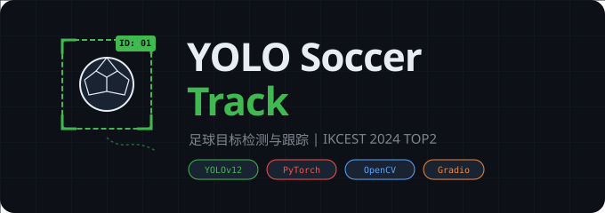
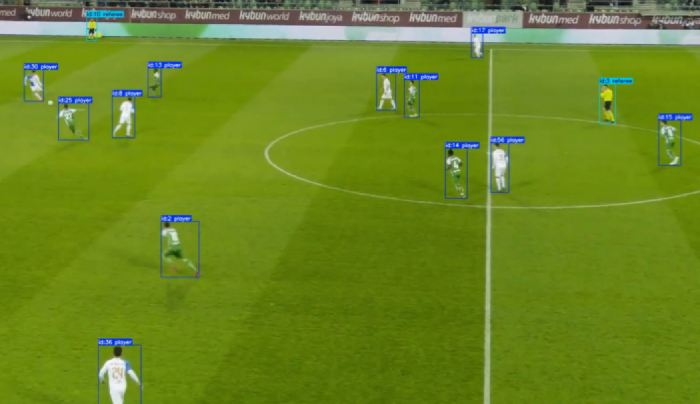

<div align="center">



<br/>
<br/>

**足球赛事目标检测与跟踪系统**

*IKCEST 2024 第十届百度&西安交大大数据竞赛 -- 初赛检测算法榜 TOP2*

[](https://www.python.org/)
[](https://pytorch.org/)
[](https://github.com/ultralytics/ultralytics)
[](https://nic.xjtu.edu.cn/info/1016/8675.htm)
[](LICENSE)
[]()

</div>

---

> **此仓库已归档，不再维护。** 本项目为 IKCEST 挑战赛参赛作品及毕业设计，仅供参考。

## 概述

基于 YOLOv12 的足球比赛实时目标检测与跟踪系统。可识别并追踪视频中的球员、裁判和足球等目标，提供从数据处理、模型训练到推理部署的全流程解决方案。



### 竞赛成绩

**2024 IKCEST 第六届"一带一路"国际大数据竞赛暨第十届百度&西安交大大数据竞赛**

| 团队 | 总分 | IDF1 | HOTA | MOTA |
|:---|:---|:---|:---|:---|
| Tang 的团队 | 2.33606 | 0.76845 | 0.69111 | 0.87649 |

[比赛官网](https://aistudio.baidu.com/competition/detail/1196/0/leaderboard) (百度 AI Studio)

### 功能特性

- **多模型支持** -- 集成 YOLOv8/v10/v11/v12 和 RT-DETR 等多种目标检测模型
- **实时跟踪** -- 对足球场景目标进行准确的检测与 ID 持久化跟踪
- **Web 界面** -- 基于 Gradio 的交互式界面，支持视频上传和摄像头实时检测
- **多线程处理** -- 高效的并行数据处理流程

---

## 技术栈

| 组件 | 用途 |
|:---|:---|
| PyTorch 2.x | 深度学习框架 |
| YOLOv12 / YOLOv8 / RT-DETR | 目标检测模型 |
| OpenCV 4.x | 视觉处理 |
| Gradio | Web 用户界面 |
| Pandas / NumPy | 数据处理 |

---

## 使用方法

### 环境要求

| 要求 | 说明 |
|:---|:---|
| Python | >= 3.8 |
| CUDA | >= 11.7 (GPU 加速推荐) |
| RAM | >= 8GB |
| GPU | >= 4GB 显存 (推荐 RTX 系列) |

### 安装

```bash
git clone https://github.com/Past-Tang/YOLO-Soccer-Track.git
cd YOLO-Soccer-Track
pip install -r requirements.txt
```

### 数据处理

将原始足球视频数据转换为 YOLO 训练格式：

```bash
python data_processor.py
```

### 模型训练

```bash
python train_model.py
```

### 视频推理

```bash
python inference.py
```

### 启动 Web 界面

```bash
python user_interface.py
```

---

## 项目结构

```
YOLO-Soccer-Track/
├── data_processor.py        # 数据预处理
├── train_model.py           # 模型训练
├── inference.py             # 视频推理
├── user_interface.py        # Gradio Web 界面
├── requirements.txt         # 依赖
├── models/                  # 模型权重
│   └── model_yolov12n.pt   # YOLOv12 nano
├── raw_data/                # 原始数据
├── processed_data/          # 处理后数据
└── IKCEST_initial/          # 比赛初始文件
```

---

## 配置参数

### 数据处理

| 参数 | 默认值 | 说明 |
|:---|:---|:---|
| `train_ratio` | 0.8 | 训练集/验证集比例 |
| 线程数 | CPU 核心数 | 并行处理线程 |

### 模型训练

| 参数 | 默认值 | 说明 |
|:---|:---|:---|
| `batch` | - | 批处理大小（按 GPU 显存调整） |
| `imgsz` | 1024 | 输入图像尺寸 |
| `epochs` | 50 | 训练轮数 |

### 推理

| 参数 | 默认值 | 说明 |
|:---|:---|:---|
| `conf` | 0.25 | 置信度阈值 |
| `persist` | True | ID 持久化跟踪 |

---

## API 示例

```python
from ultralytics import YOLO

model = YOLO('models/model_yolov12n.pt')

# 目标检测
results = model.predict(frame, conf=0.25)

# 目标跟踪（带 ID 持久化）
results = model.track(frame, persist=True, conf=0.25)
```

---

## 致谢

- [Ultralytics](https://github.com/ultralytics/ultralytics) -- YOLO 系列模型
- IKCEST 挑战赛组委会 -- 数据集与比赛平台
- 百度与西安交通大学 -- 联合举办大数据竞赛

---

## 免责声明

本项目采用 MIT 许可证。此项目为竞赛参赛作品，现已归档，不再维护。


